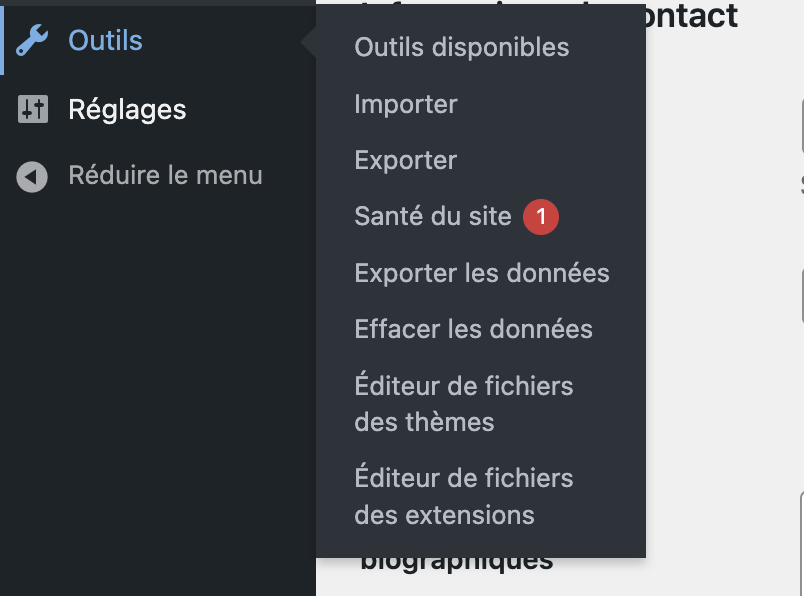
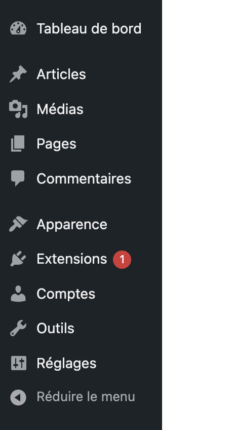
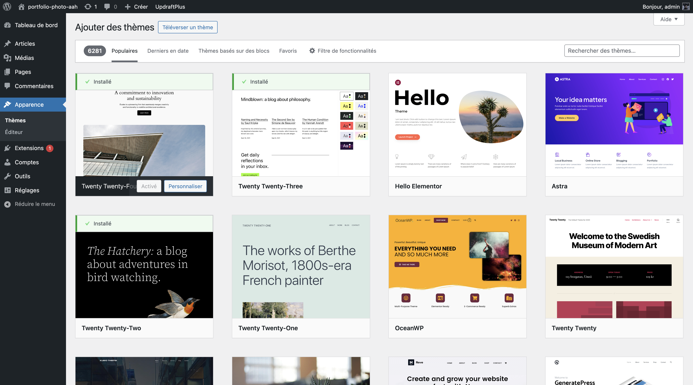
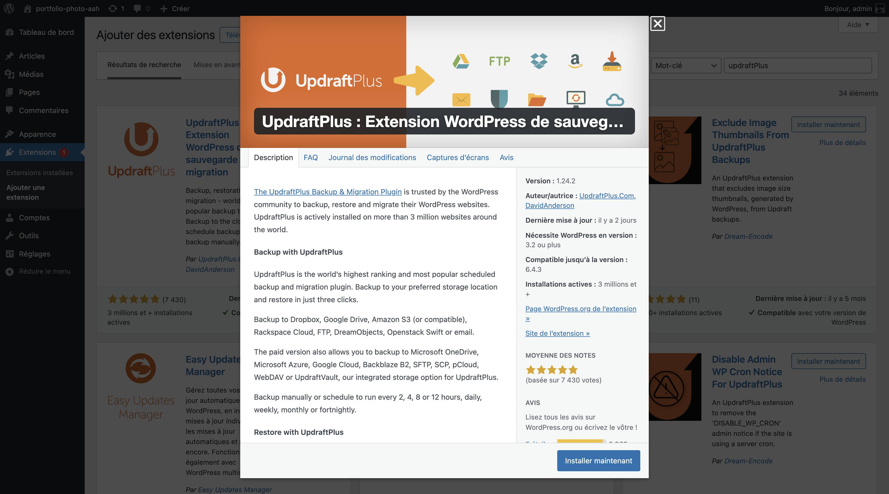
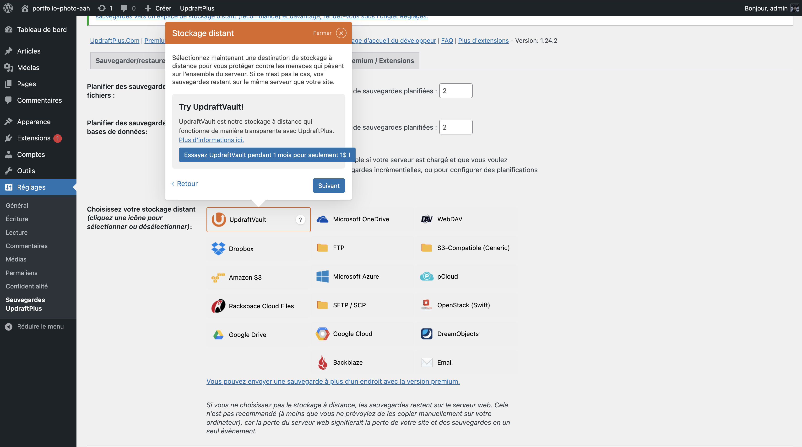
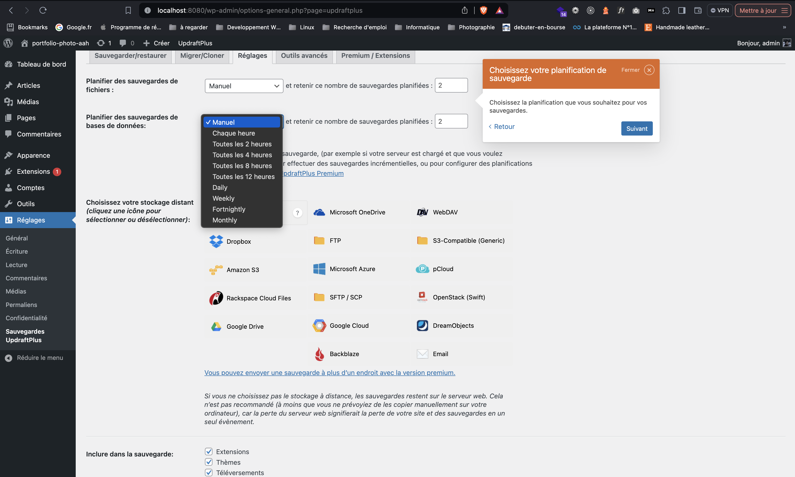
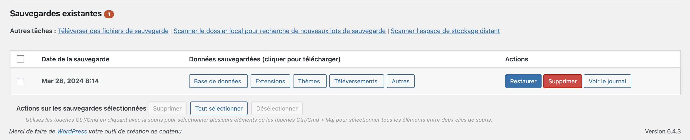

# Premiers pas

Dans ce chapitre, découvrons l'interface de WordPress.

À gauche, vous trouverez des onglets menant vers diverses fonctionnalités de votre site. Cette section risque de se remplir rapidement au fur et à mesure que vous ajouterez des extensions (et oui, les extensions peuvent ajouter de nouveaux onglets !).

En haut à droite de l'interface, vous trouverez deux petits onglets : "Options de l'écran" et "Aide". Ces deux onglets apparaissent sur la majorité des sections de votre interface administrateur. Ils sont particulièrement utils quand il s'agit de chercher des informations sur une fonctionnalité de la section dans laquelle vous êtes.

Vous trouverez une barre horizontale en haut de votre interface. Par défaut vous pouvez aller sur votre site, voir si des mises à jour sont disponibles, créer de nouveaux contenus et tout à droite, quelques actions sur votre compte.

# Aperçu sur la bare lattérale de l'interface administrateur de WordPress

1. **Tableau de bord** : L'interface principale de WordPress qui donne un aperçu du contenu et de l'activité du site. Il offre un accès rapide aux statistiques du site, aux mises à jour et à d'autres informations.

2. **Articles** : Gère les articles (ou "posts") du site, y compris l'ajout de nouveaux articles, la modification des articles existants, la gestion des catégories et des étiquettes.

3. **Médias** : Bibliothèque où tous les fichiers téléchargés sont stockés et gérés. Cela inclut les images, les vidéos, les fichiers audio et d'autres documents.

4. **Pages** : Similaire à la gestion des articles, mais spécifique aux pages statiques de votre site comme la page d'accueil, la page de contact, etc.

5. **Commentaires** : Section où vous pouvez modérer les commentaires faits par les visiteurs sur les articles et les pages.

6. **Apparence** : Cet onglet vous permet de changer le thème de votre site, de personnaliser le design, de gérer les widgets et les menus, et parfois de modifier d'autres paramètres esthétiques.

7. **Extensions** : Ici vous pouvez ajouter, activer, désactiver et gérer les extensions (plugins). Une notification indique qu'il y a une mise à jour ou une notification pour une extension.

8. **Comptes** : Cette section est dédiée à la gestion des utilisateurs et de leurs rôles sur le site (l'onglet standard de WordPress est "Utilisateurs"). Mais aussi à la personnalisation du back-office.

9. **Outils** : Contient divers outils pour effectuer des opérations spéciales comme l'importation/exportation de contenu, la vérification de la santé du site et d'autres utilitaires.

10. **Réglages** : Ce menu fournit l'accès aux réglages généraux du site, aux réglages d'écriture, de lecture, de discussion, aux médias et aux permaliens, entre autres.

11. **Réduire le menu** : Permet de réduire ou d'étendre la barre de menu pour afficher soit les icônes soit les icônes avec les textes. 

Ces onglets constituent l'essentiel de la navigation dans le back-office de WordPress, offrant un contrôle complet sur la gestion du contenu et des paramètres du site.

# Personnaliser son interface administrateur

On a vu qu'on pouvait changer les options d'affichage des élément avec l'onglet "Options de l'écran", mais on peut faire mieux !

Dans la partie **Comptes > Profil**, vous pouvez d'avantage personnaliser votre interface administrateur.

# Aperçus sur l'onglet outils

Dans cette section de l'interface administrateur, plusieurs paramètres peuvent être utils :

1. **Importer** : Cette option permet d'importer du contenu vers votre site WordPress depuis un autre site WordPress ou d'autres plateformes de blogging/CMS.

2. **Exporter** : À l'inverse, cette fonctionnalité permet d'exporter le contenu de votre site WordPress, comme les articles, pages et médias, pour les sauvegarder ou les transférer vers un autre site.

3. **Santé du site** : Cette section donne un aperçu de la santé globale de votre installation WordPress. Elle peut signaler des problèmes de sécurité, de performance, et fournir des recommandations pour améliorer la configuration de votre site.

4. **Exporter les données** : Semblable à "Exporter", mais cela pourrait être plus spécifique aux données personnelles des utilisateurs ou autres données spécifiques conformément aux réglementations sur la protection des données, comme le RGPD.

5. **Effacer les données** : Cette option peut être utilisée pour effacer certaines données du site. Elle doit être utilisée avec prudence, car elle pourrait supprimer définitivement des données importantes.

6. **Éditeur de fichiers des thèmes** : Cet éditeur intégré permet de modifier directement les fichiers des thèmes installés sur votre site WordPress. Il est utile pour les modifications rapides de code mais comporte des risques si l'on ne maîtrise pas bien le développement web.

7. **Éditeur de fichiers des extensions** : Similaire à l'éditeur de fichiers des thèmes, mais pour les extensions (plugins). Il permet de modifier le code des extensions installées.

Ces outils sont assez avancés et leur utilisation incorrecte peut entraîner des problèmes sur le site. Il est généralement recommandé de faire des sauvegardes complètes avant d'utiliser les fonctionnalités qui modifient les fichiers ou les données.

# Modifier les permaliens

Je peux vous suggérer une première modification du site qui ne sera que bénéfique pour le SEO : avoir des URL claire et explicites sur le contenu de la page web.

Pour ce faire il faut aller dans **Réglages > Permaliens** et mettre la structure des permaliens sur "Titre de la publication".

> [!NOTE]
> :point_up: Quand vous faites une modification, pensez à enregistrer les modifications. C'est le bouton en bas de la page !

# Changer le thème

Pour changer le thème, rien de plus simple : dans **Apparence > Thèmes** vous pouvez activer un autre thème ou en ajouter via le bouton "Ajouter un thème".

> [!WARNING]
> Les thèmes inutilisés comme les extensions inutilisées peuvent causer des problèmes de performance.
> Pensez à supprimer les thèmes que vous n'utilisez pas.

> [!WARNING]
> L'une des principals faille de sécurité sur WordPress son les thèmes et le extensions pas à jour, c'est pour ça qu'il est parfois conseillé de ne pas surcharger votre projet WordPress avec des extensions qui ont peu d'intérêt (Imaginé devoir constamment chercher les mises à jour sur un site qui a accumulé une centaine d'extension).  
> Aussi, choisissez des thèmes et extensions qui sont souvent à jour.

On vas utiliser le thème sur Twenty Twenty-Four pour la suite car il s'agit d'un thème basé sur les blocs.

## Chercher et ajouter un thème

En cliquant sur "Ajouter un thème" vous pourrez récupérer des thèmes disponible en ligne et même en téléverser.

Voici une legende des options disponible sur cette interface :
  
- **Téléverser un thème** : Un bouton permettant d'uploader un thème sous forme de fichier zip. Cela est utile si vous avez un thème personnalisé ou acheté en dehors du répertoire officiel de WordPress.

- **6281** : Ce nombre indique le total des thèmes disponibles dans le répertoire WordPress au moment de la capture d'écran. C'est une indication de la diversité des options à explorer.

- **Populaires** : Un filtre qui, une fois sélectionné, affiche les thèmes les plus populaires auprès des utilisateurs de WordPress.

- **Derniers en date** : Ce filtre permet d'afficher les thèmes les plus récents ajoutés au répertoire WordPress.

- **Thèmes basés sur des blocs** : En sélectionnant ce filtre, l'utilisateur peut voir une liste de thèmes conçus pour fonctionner spécifiquement avec l'éditeur de blocs de WordPress (Gutenberg).

- **Favoris** : Ce filtre permet aux utilisateurs de voir les thèmes qu'ils ont marqués comme favoris dans le répertoire WordPress.

- **Filtre de fonctionnalités** : Un outil permettant de filtrer les thèmes selon des fonctionnalités spécifiques, telles que la mise en page, les fonctionnalités et le sujet du thème.

- **Barre de recherche** : Permet aux utilisateurs de rechercher des thèmes en tapant des mots-clés relatifs au style ou à la fonctionnalité désirée.

# Ajouter des extensions

Dans la gestion d'un site WordPress, les extensions (ou plugins) jouent un rôle crucial. Elles permettent d'étendre les fonctionnalités et d'ajouter de nouvelles caractéristiques à votre site sans avoir à écrire une seule ligne de code.

L'onglet **Extensions** dans la barre latérale de votre interface d'administration WordPress est l'endroit où toute la gestion des extensions se déroule. Voici un aperçu de ce que vous pouvez faire dans cette section :

1. **Ajouter des extensions** : WordPress dispose d'un répertoire d'extensions impressionnant. Vous pouvez ajouter de nouvelles extensions en cherchant dans le répertoire ou en téléchargeant le fichier d'extension directement. Pour ajouter une nouvelle extension, vous pouvez cliquer sur le bouton "Ajouter" ou "Ajouter une nouvelle" et suivre les instructions.

2. **Activer/Désactiver des extensions** : Une fois ajoutées, les extensions peuvent être activées ou désactivées en un clic. Il est important de ne garder activées que les extensions nécessaires, car elles peuvent affecter les performances du site et sa sécurité.

3. **Mettre à jour des extensions** : La notification que vous voyez à côté de l'onglet "Extensions" indique généralement qu'une ou plusieurs extensions ont besoin d'une mise à jour. Il est crucial de les maintenir à jour pour des raisons de sécurité et de fonctionnalités.

4. **Configurer des extensions** : Après l'activation, de nombreuses extensions ont leurs propres réglages que vous devez configurer. Cela se fait généralement via un lien dans la liste des extensions ou via un nouvel onglet ajouté quelque part dans l'interface d'administration.

5. **Supprimer des extensions** : Si vous n'avez plus besoin d'une extension, il est recommandé de la désactiver et de la supprimer afin de garder votre site propre et performant.

L'ajout d'extensions est souvent tentant, car elles peuvent apporter des fonctionnalités impressionnantes et utiles à votre site. Cependant, il est important de garder à l'esprit que chaque extension ajoutée est un autre élément à maintenir à jour et à sécuriser. Choisissez des extensions de confiance, maintenues régulièrement, et qui ont des évaluations positives de la communauté WordPress.

En suivant ces conseils, vous pourrez enrichir votre site WordPress tout en maintenant un environnement stable et sécurisé.

> [!TIP]
> Avant d'ajouter ou de mettre à jour des extensions, assurez-vous de sauvegarder votre site. Cela vous permettra de restaurer la version précédente en cas de problème avec une nouvelle extension.

> [!IMPORTANT]
> Surveillez l'utilisation des ressources par les extensions. Certaines peuvent consommer plus de ressources que d'autres, ce qui peut ralentir votre site. Utilisez des outils de profilage pour surveiller l'impact des extensions sur les performances de votre site.

Avec ces pratiques en place, votre expérience WordPress sera non seulement plus sûre, mais aussi plus agréable et efficace.

# Sauvegarder votre site WordPress

La sauvegarde régulière de votre site WordPress est une étape essentielle pour assurer la sécurité et la durabilité de votre présence en ligne. Les sauvegardes vous protègent contre les pertes de données et vous permettent de restaurer votre site en cas de piratage, de défaillance du serveur, de mises à jour ratées ou de tout autre problème inattendu.

**Comment et où sauvegarder ?**

Il est conseillé d'effectuer des sauvegardes complètes qui incluent à la fois les fichiers du site et la base de données. Voici les étapes générales à suivre :

1. **Choisissez un outil de sauvegarde** : WordPress propose plusieurs extensions de sauvegarde, comme UpdraftPlus, BackupBuddy ou Jetpack Backups, qui peuvent automatiser ce processus.

2. **Déterminez la fréquence de sauvegarde** : La fréquence doit correspondre à la fréquence de mise à jour de votre site. Les sites très actifs pourraient nécessiter une sauvegarde quotidienne, tandis que pour les sites moins actifs, une sauvegarde hebdomadaire ou mensuelle peut suffire.

3. **Stockez les sauvegardes en toute sécurité** : Ne conservez jamais vos sauvegardes uniquement sur votre serveur d'hébergement. Utilisez des services de stockage en cloud comme Dropbox, Google Drive, ou Amazon S3, ou téléchargez-les sur un ordinateur local.

4. **Testez vos sauvegardes** : Assurez-vous que vos sauvegardes fonctionnent en les utilisant pour restaurer votre site sur un environnement de test.

5. **Automatisez le processus** : Configurez vos extensions pour qu'elles effectuent des sauvegardes automatiquement à une fréquence déterminée et qu'elles envoient les fichiers vers votre solution de stockage choisie.

> [!CAUTION]
> Les sauvegardes peuvent prendre beaucoup d'espace de stockage, surtout pour les grands sites. Vérifiez régulièrement l'espace disponible sur votre solution de stockage et nettoyez les anciennes sauvegardes si nécessaire.

**Restaurer à partir d'une sauvegarde**

Si le moment vient où vous devez restaurer votre site à partir d'une sauvegarde :

1. **Accédez à votre outil de sauvegarde** : Connectez-vous à votre interface WordPress ou directement à votre solution de stockage cloud.

2. **Choisissez la sauvegarde appropriée** : Sélectionnez la sauvegarde que vous souhaitez restaurer, idéalement la plus récente avant le problème.

3. **Suivez le processus de restauration** : Utilisez l'outil de sauvegarde pour initier le processus de restauration. Cela peut généralement se faire en quelques clics.

La sauvegarde est une police d'assurance pour votre site Web. En prenant le temps de mettre en place une stratégie de sauvegarde robuste, vous économiserez un temps précieux et éviterez des maux de tête en cas de problème.