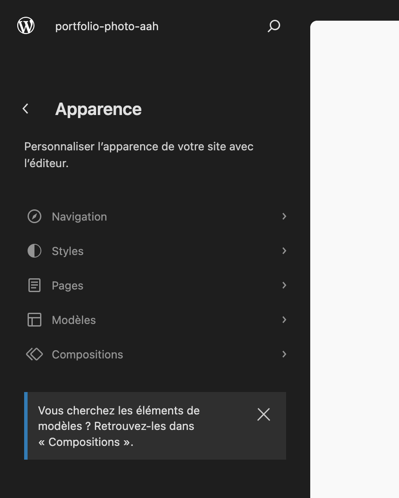
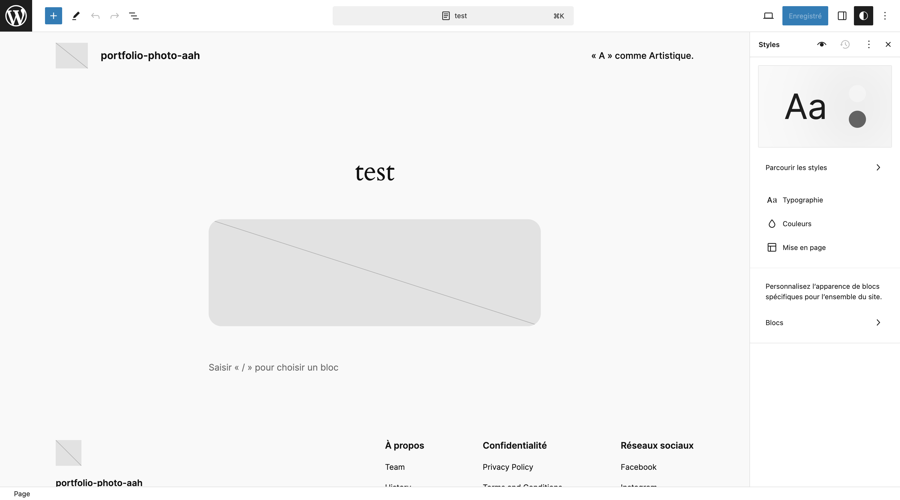

# Éditer les pages de votre site

Vous pouvez créer des pages depuis l'onglet **Pages** et les gérer.

Mais il y a aussi l'éditeur de site dans lequelle il est possible de créer/éditer des pages, thémes, barre de navigation, etc...

Pour accéder a l'éditeur de site, il faut allé dans **Apparence > Éditeur**.

Un raccourcie pratique et le **CTRL + K (⌘ + K pour les utilisateur macOS)**. Ce raccourcie vous ouvre une simple bare de recherche qui vous donne accès à divers fonctionnalités.

# Découvert de l'éditeur de site

Détaillon cet image :

1. **Navigation** : Cette onglet nous permet de gérerles barres de navigation.
2. **Style** : On va pouvoir gérer la charte grafique de notre site (les polices, couleurs, etc...).
3. **Pages** : Nous permet de créer de nouvelles pages.
4. **Modèles** : Vous pourez créer des models qui pourront être réutilisable.
5. **Compositions** : Les compositions sont en générale des éléments réutilisables (trés pratique par exemple pour des bouttons call-to-action).

# L'éditeur de bloc

Quand vous éditer une page, vous pouvez insérer des bloc