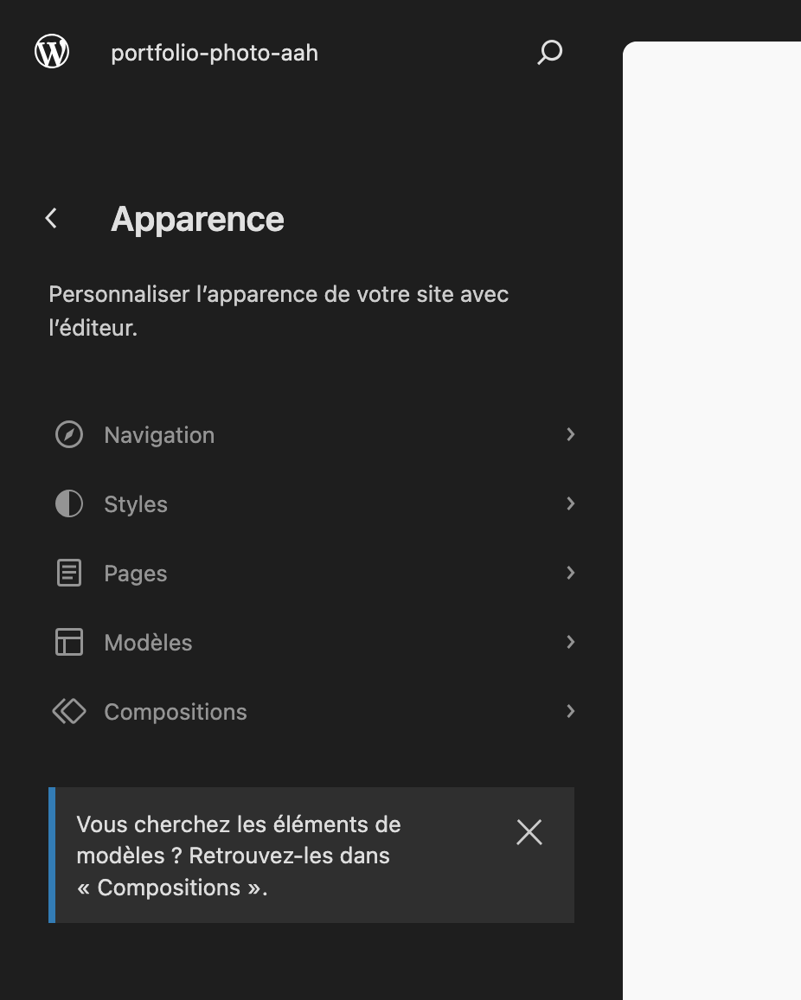
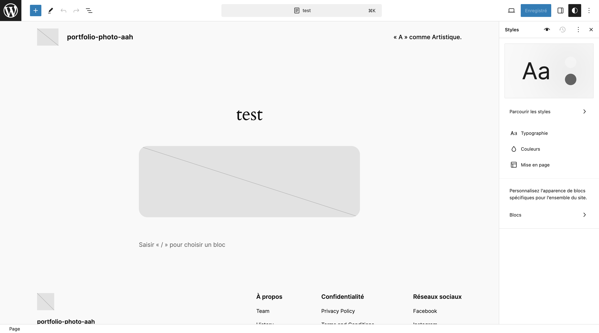
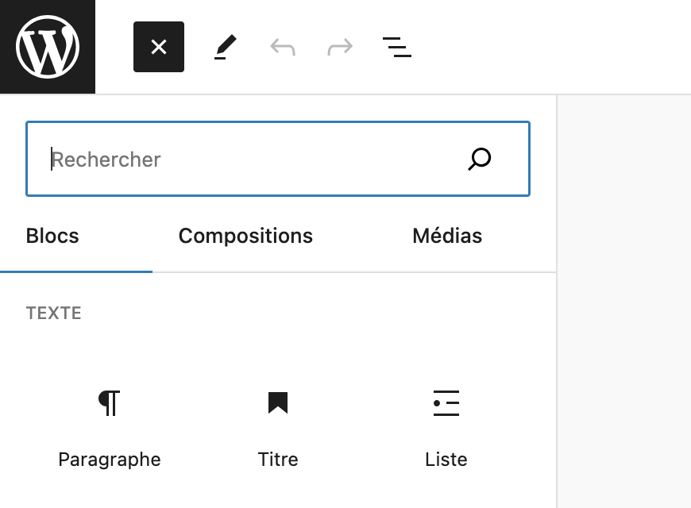
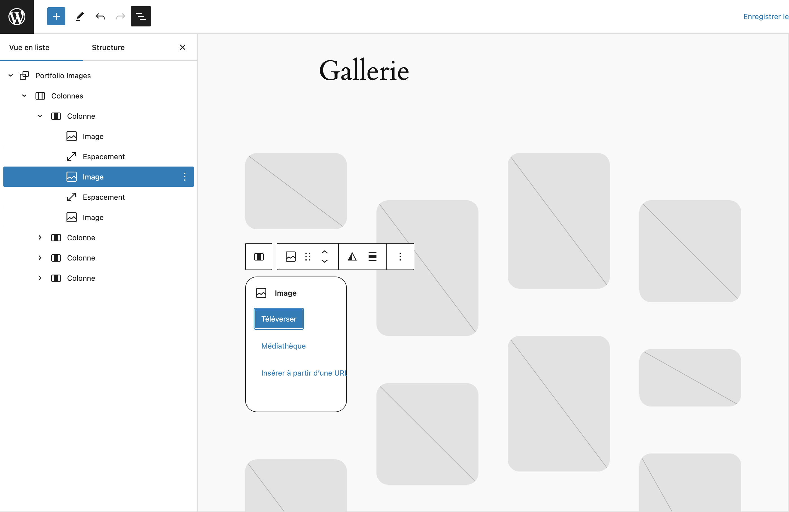
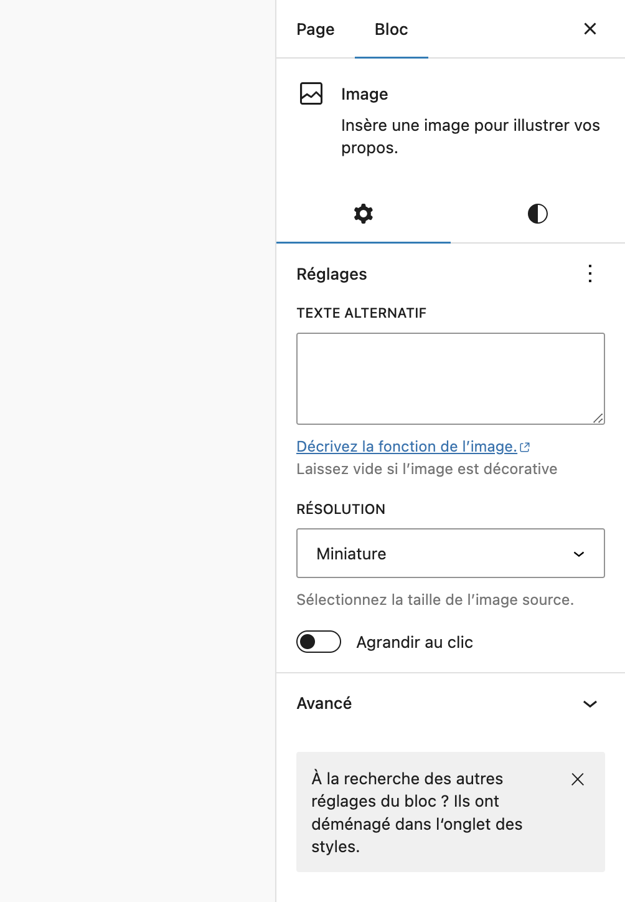

# Éditer les pages de votre site

Vous pouvez créer des pages depuis l'onglet **Pages** et les gérer.

Mais il y a aussi l'éditeur de site dans lequelle il est possible de créer/éditer des pages, thémes, menu de navigation, etc...

Pour accéder a l'éditeur de site, il faut aller dans **Apparence > Éditeur**.

Un raccourcie pratique sur l'éditeur de bloc et de site est le **CTRL + K (⌘ + K pour les utilisateur macOS)**. Ce raccourcie vous ouvre une simple barre de recherche qui vous donne accès à divers fonctionnalités.

# Découvert de l'éditeur de site

Détaillon cette image :

1. **Navigation** : Cette onglet nous permet de gérer les menus de navigation.
2. **Style** : On va pouvoir gérer la charte grafique de notre site (les polices, couleurs, etc...).
3. **Pages** : Nous permet de créer de nouvelles pages.
4. **Modèles** : Vous pourez créer des models qui pourront être réutilisable.
5. **Compositions** : Les compositions sont en générale des éléments réutilisables (trés pratique par exemple pour des bouttons call-to-action).

# L'éditeur de bloc

Quand vous éditez une page, vous pouvez insérer des blocs si le thème choisi est un thème basé sur les blocs.

En haut à gauche, vous trouverez :
- l'outil d'insertion de blocs (Le petit boutton plus en bleu).
- Les boutton annulé/rétablir (accéssible depuis **CTRL + Z** et **CTRL + MAJ + Z**)
- La vue en liste (très pratique pour séléctionner un élément)

Parmi les différents blocs (accessibles depuis l'outil d'insertion de blocs), vous trouverez de quoi créer (bloc par bloc) une galerie, par exemple vous pourriez créer une galerie en "masonry".

# Les réglages

Dans le menu à droite, vous avez accès aux réglage de la page. Mais aussi aux réglages du bloc séléctionné.

Je vous laisse explorer les réglages possible sur les bloc que vous séléctionnez.